# 🚀 Hirely

### AI-Assisted Recruitment & Adaptive Interview Platform

Hirely is an end-to-end recruitment platform that connects **job discovery, applications, resume screening, adaptive interviews, and expert evaluation** in a unified workflow.

The platform is designed to support both sides of the recruitment process: **candidates looking for opportunities** and **experts managing and evaluating candidates**.

---

## ✨ Key Features

### Candidate

- Browse and search open positions
- View detailed job descriptions
- Apply for job opportunities
- Upload resumes
- AI-assisted resume screening
- Job-resume matching
- Track application status
- View scheduled interviews
- Participate in online interviews
- Answer interview questions through text or voice

### Expert / Recruiter

- Manage open positions
- Review candidate applications
- View candidate profiles and resumes
- Access AI-assisted screening results
- Shortlist relevant candidates
- Review and modify interview questions
- Schedule interviews
- Participate in live interviews
- Evaluate candidate responses
- Make recruitment decisions

### AI-Assisted Capabilities

- Resume parsing and text extraction
- Job-resume matching
- Candidate screening
- Adaptive interview question generation
- Interview response analysis
- AI-assisted candidate evaluation

---

## 🔄 Recruitment Workflow

### Candidate Journey

**Find Jobs → View Position → Apply → Resume Screening → Track Application → Interview → Evaluation**

### Expert Journey

**Create Position → Review Applications → AI-Assisted Screening → Shortlist → Schedule Interview → Evaluate Candidate → Final Decision**

---

## 🛠️ Technology Stack

| Layer | Technologies |
|---|---|
| **Frontend** | HTML, CSS, JavaScript |
| **Backend** | Python,FastAPI|
| **Data Storage** |Browser Local Storage |
| **AI / Processing** | NLP, Resume Parsing with PyMuPDF, AI-Assisted Screening,Speech Recognition with PocketSphinx |
| **Communication** | REST APIs, WebSockets |
| **Browser APIs** | Storage Event API,Web Storage API,Web Speech API, MediaRecorder API |
| **Version Control** | Git, GitHub |

---

## 📸 Project Screenshots

### 🏠 Home

**The Hirely homepage where candidates can browse available open positions and explore job opportunities.**

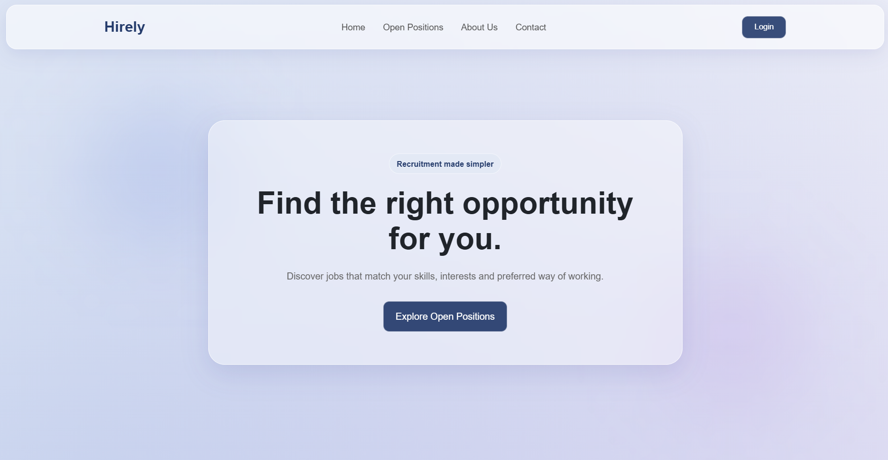

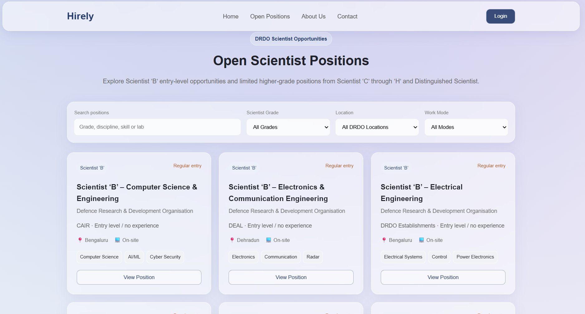

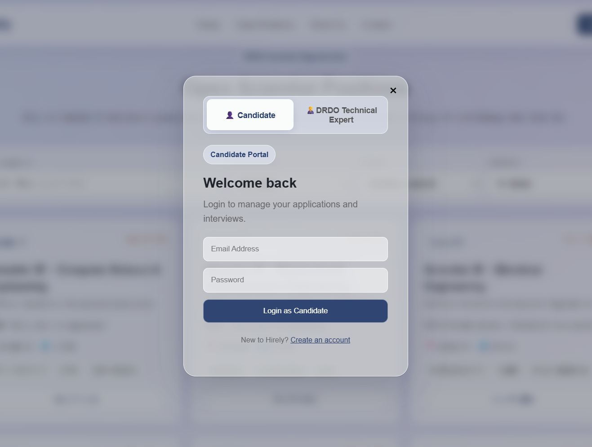

---

### 👨‍💻 Candidate Portal

**The candidate portal where candidates can find jobs, view job details, apply for positions, complete resume screening, track applications, and proceed through the interview process.**

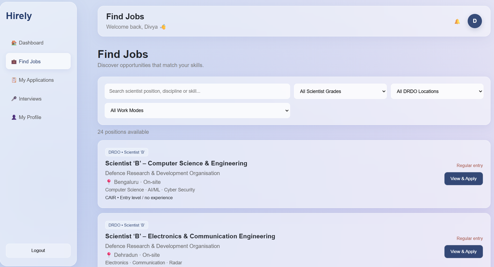

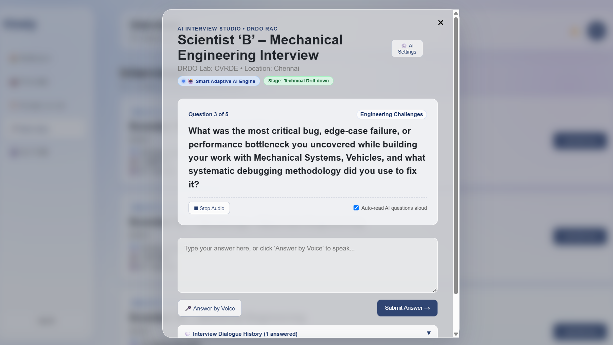

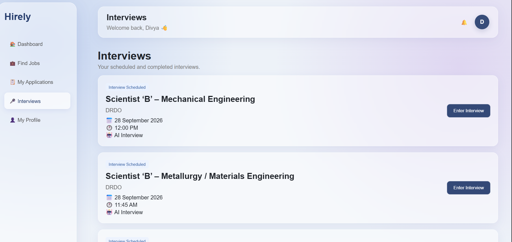

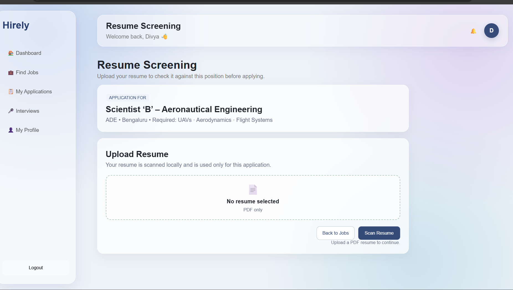

---

### 👩‍💼 Expert Portal

**The expert portal where recruiters can review applications, evaluate AI-screened candidates, shortlist candidates, conduct interviews, and make recruitment decisions.**

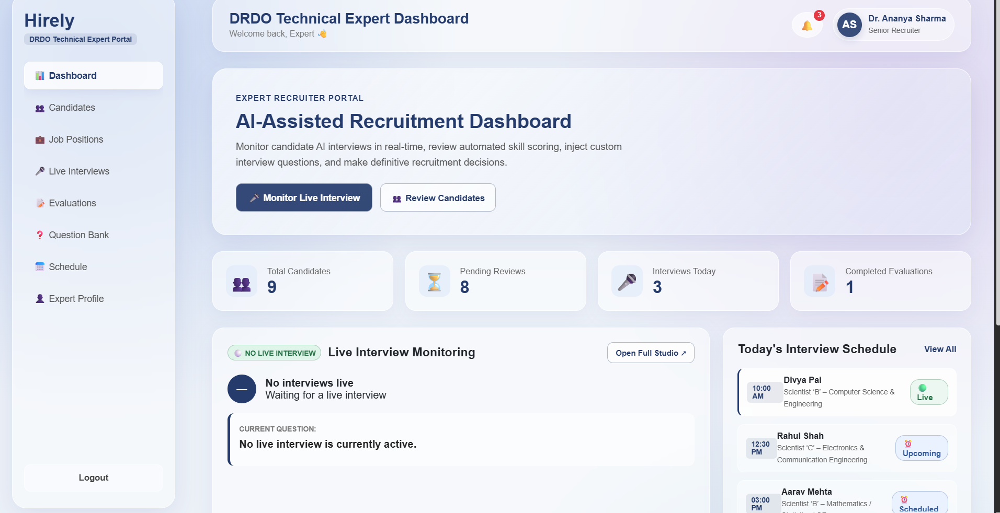

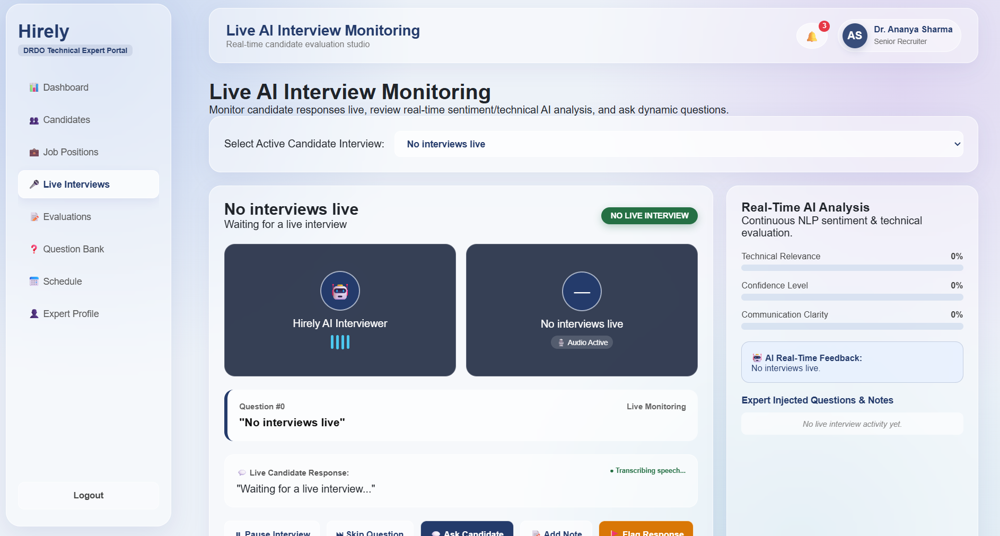

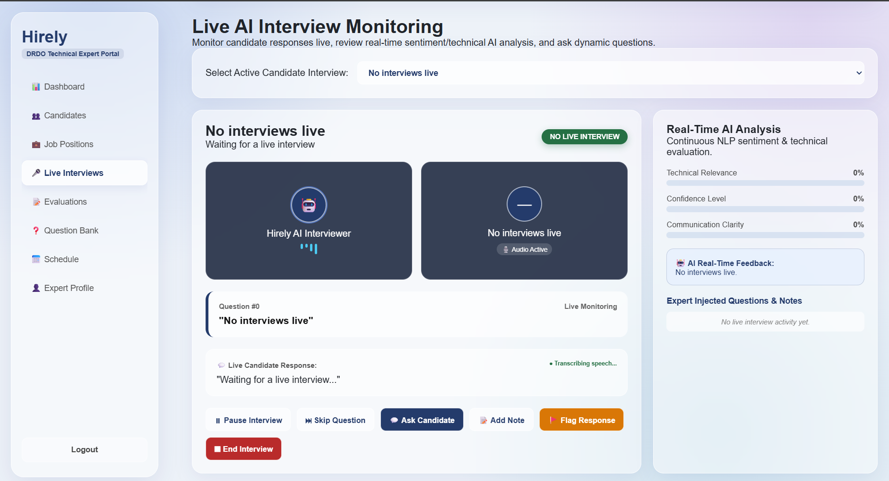

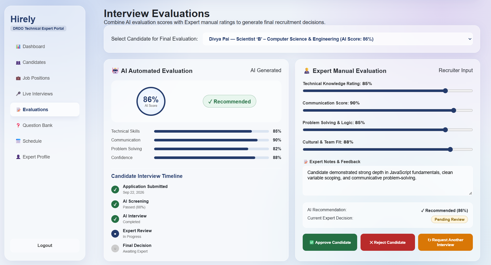

---

## 🧩 System Overview

Hirely is organized around three connected layers:

### 1. Candidate Portal

Provides candidates with a complete recruitment journey, from discovering job opportunities to applying, completing resume screening, tracking applications, and participating in interviews.

### 2. AI-Assisted Recruitment Layer

Processes resumes and job requirements to support candidate screening, job-resume matching, adaptive interview question generation, and interview evaluation.

### 3. Expert Portal

Provides recruiters with tools to manage positions, review applications, evaluate candidates, shortlist applicants, schedule interviews, and participate in the final evaluation process.

---

## 🎯 Project Objective

Hirely aims to simplify and connect the major stages of recruitment through a single platform while using AI-assisted features to support **candidate screening and adaptive interviewing**.

The platform focuses on creating a structured workflow for both candidates and recruitment experts.

---

## 🌱 Future Scope

- Semantic-based resume and job matching
- Advanced recruitment analytics
- Automated candidate notifications
- Enhanced speech-based interviews
- Cloud deployment
- Advanced candidate insights
- Expanded authentication and security

---

